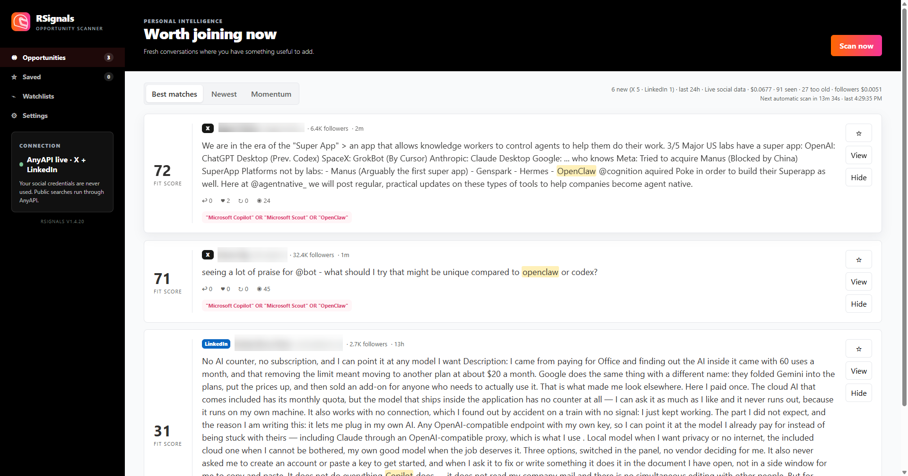
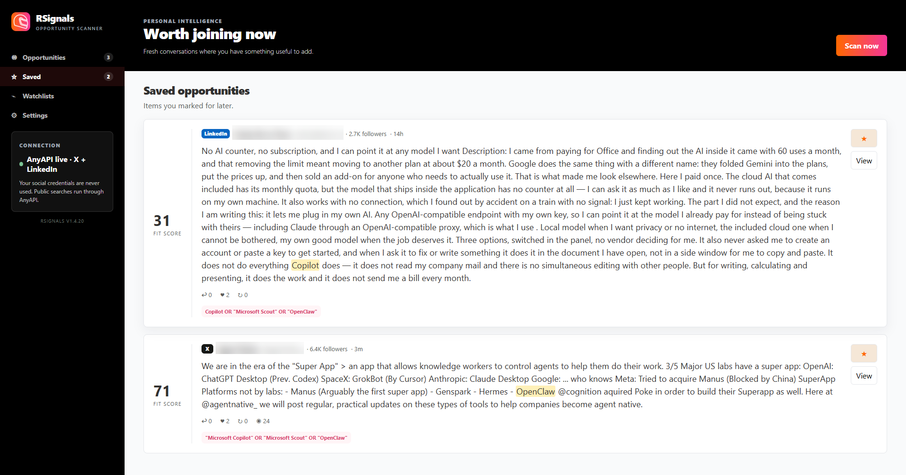
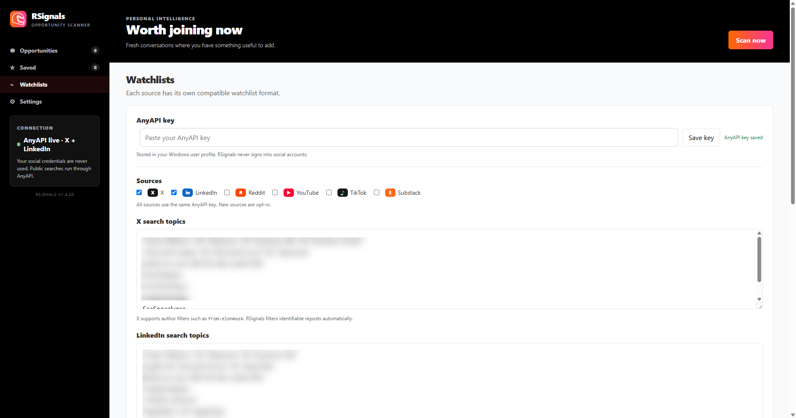
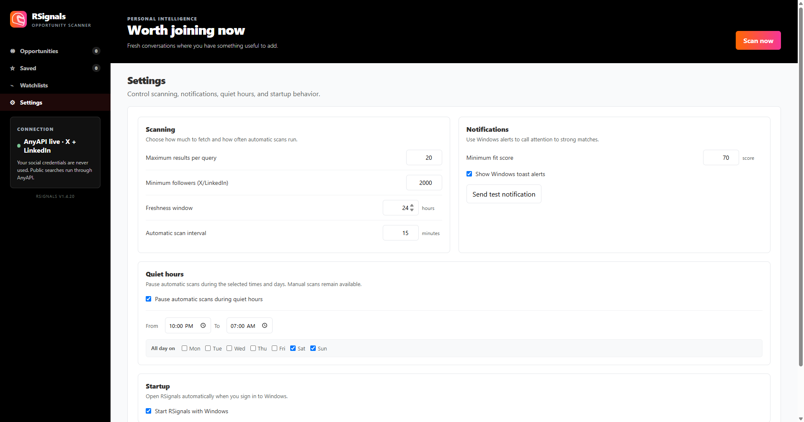

# RSignals

RSignals is a Windows desktop opportunity scanner for finding fresh public conversations where you have something useful to add.

It searches public sources through AnyAPI, normalizes results into one feed, scores likely opportunities, and lets you save, hide, inspect, and open posts without signing into the social platforms.

## Read-only behavior

RSignals does not automatically act on your behalf. It never creates posts, comments, likes, reposts, messages, follows, or other social activity. It only reads public results through AnyAPI and can open the source link so you can decide what to do manually.

## Current status

Version 1.4.22 is a Windows x64 Electron application. X and LinkedIn are enabled by default. Reddit, YouTube, TikTok, and Substack are available as opt-in sources.

The application is local-first and single-user. It does not require a database or hosted backend.

## Author

Created and maintained by Steve Mordue.

This is the public RSignal snapshot. Active development, experiments, and unreleased work remain in the private `RSignalDev` repository.

## Screenshots

| Opportunities | Saved |
| --- | --- |
|  |  |
| Watchlists | Settings |
|  |  |

## Features

- Fresh feed with Best matches, Newest, and Momentum views.
- Opportunity scoring prioritizes fresh, unanswered posts so you can engage early; replies reduce the score as the conversation fills up.
- Search terms are highlighted in result text for faster scanning.
- Original post line breaks are preserved, with long posts expandable after a 10-line preview.
- Separate watchlists for each source.
- X search with `queryType: "Latest"`, author filters, and local repost exclusion.
- Direct LinkedIn search ordered by publication date, with rich author and engagement details.
- Follower counts for X and LinkedIn authors when available.
- Optional minimum-follower filtering for X and LinkedIn opportunities and alerts.
- Comment and reply records are excluded when the source identifies them; the feed keeps original posts.
- Reddit keyword search and YouTube search for recent uploads.
- TikTok hashtag monitoring through the timestamped hashtag endpoint.
- Substack publication monitoring by publication URL.
- Save and hide actions persisted across rescans and restarts.
- Relative timestamps that refresh while the app is open.
- Manual scanning and configurable background scanning.
- Self-registering Windows toast notifications for ZIP builds, a test notification control, and tray controls.
- Demo mode when no AnyAPI key is configured.

## Supported sources

| Source | AnyAPI SKU | Request behavior | Watchlist entry |
| --- | --- | --- | --- |
| X | `twitter.search` | Latest results | One search topic per line |
| LinkedIn | `linkedin.search_posts_full` | Latest posts from the last day, capped at 10 per query; last week for wider freshness windows | One keyword, phrase, or Boolean query per line |
| Reddit | `reddit.search` | New posts from the last week | Search text or Reddit operators |
| YouTube | `youtube.search` | Recent uploads from the current week | Search text or phrase |
| TikTok | `tiktok.hashtag_videos` | Timestamped hashtag results | One hashtag per line |
| Substack | `substack.posts` | Recent posts from a publication | One publication URL per line |

### Query guidance

X supports filters such as:

```text
"workflow automation" OR "business software"
from:example_account "enterprise AI"
```

Use the username without `@` in `from:`. RSignals filters identifiable reposts after retrieval, so you do not need `-is:retweet`. X-specific operators are removed before queries are sent to other sources.

LinkedIn works best with plain keywords and quoted phrases:

```text
"enterprise AI" workflow automation
"developer tools" OR "business software"
```

Reddit accepts terms and operators such as `subreddit:technology`, `author:username`, `title:agents`, and boolean `AND`/`OR`/`NOT`.

YouTube accepts plain keywords and phrases. RSignals requests recent uploads and applies the local freshness rule afterward.

TikTok entries are hashtags because the timestamped endpoint provides a reliable publication time. Enter `aiagents` or `#aiagents`, not a full sentence.

Substack is publication-based rather than keyword-based. Enter a publication URL such as `https://example.substack.com`.

## Install the Windows application

1. Download the latest RSignals Windows x64 ZIP release.
2. Extract the ZIP to a local folder.
3. Run `RSignals.exe` from the extracted folder.

When building from source, run `Build and Install Signal.bat`. The legacy filename is retained for compatibility; the installed product, shortcut, window, tray menu, and installer artifact are branded RSignals.

The installer is per-user and does not require an installation-folder choice. The internal application ID remains stable so existing settings continue across the product-name rename.

## Run from source

### Requirements

- Windows 10 or later.
- Node.js LTS.
- An AnyAPI key for live results. The UI runs in demo mode without one.

### Commands

```powershell
npm ci
npm test
npm start
```

For a packaged Windows directory build, run `npm run pack`. For a Windows x64 installer, run `npm run dist`.

## Windows code signing

Release builds use Azure Artifact Signing with the existing Forceworks Public Trust profile `AppCodeSigning` / `rclbc-appsource`. Azure credentials are supplied by the local or CI authentication environment and are never stored in this repository. The build fails instead of producing an unsigned installer when signing is unavailable.

## AnyAPI configuration

Get an AnyAPI key at [getanyapi.com](https://getanyapi.com/). Paste it into Watchlists and select Save key. The key is stored locally in the Electron user-data directory and is never sent to the social platforms directly.

Follower counts load after scan results appear. RSignals deduplicates authors and caches profile counts locally for 24 hours to limit paid `twitter.profile` and `linkedin.profile` calls. Counts are omitted when a profile cannot be resolved.

Optional SKU overrides are available for development:

```text
ANYAPI_TWITTER_SEARCH_SKU
ANYAPI_LINKEDIN_SEARCH_SKU
ANYAPI_REDDIT_SEARCH_SKU
ANYAPI_YOUTUBE_SEARCH_SKU
ANYAPI_TIKTOK_SEARCH_SKU
ANYAPI_SUBSTACK_SEARCH_SKU
```

## Freshness, timestamps, and deduplication

RSignals marks a post as seen only after it has a normalized publication timestamp, passed the configured maximum-age rule, passed current-scan deduplication, and survived the comment/reply filter.

Timestamp handling supports Unix seconds, Unix milliseconds, ISO dates, relative values, and the published/created field variants returned by AnyAPI. Card timestamps recalculate while the app is open, so `3m` can become `13m`.

## Local data and privacy

- Watchlists, saved posts, hidden posts, scan settings, and notification settings use browser `localStorage`.
- The AnyAPI key is stored in `anyapi-key.txt` under the Electron user-data directory.
- Seen-post history is stored in `seen-posts.json` and trimmed to recent history.
- The server may write sanitized internal logs and last-response files for troubleshooting.
- Raw response fixture capture is opt-in through `SIGNAL_DIAGNOSTIC_MODE=1` and sanitizes credentials and sensitive values.

RSignals does not use platform login cookies or credentials. Never commit API keys, runtime files, logs, diagnostic output, `node_modules`, or `dist`; the repository `.gitignore` excludes these paths.

### Secret-scanning pre-commit hook

This repository is public, so a `pre-commit` hook in `.githooks/` rejects commits that stage a credential file or an added line matching a known secret format. Git does not enable a repository's hooks automatically; run this once per clone:

```bash
git config core.hooksPath .githooks
```

The hook blocks credential and runtime filenames even when `git add -f` was used to bypass `.gitignore`. For a genuine false positive, append `pragma: allowlist secret` to the line. To override the hook for a single commit, use `git commit --no-verify`.

## Project layout

```text
main.js                 Electron window, tray, notifications, and startup
preload.cjs             Narrow renderer-to-main IPC bridge
server.js               Local HTTP server, AnyAPI calls, parsers, dedupe, freshness
public/index.html       Application markup
public/app.js           Renderer state, scanning, cards, and settings
public/styles.css       RapidStarter-aligned visual system
public/rs-logo.png      RapidStarter brand logo
assets/                 Windows application assets
test/server.test.js     Parser and request regression tests
test/fixtures/          Sanitized AnyAPI response fixtures
```

## Testing and verification

```powershell
node --check main.js
node --check server.js
node --check public/app.js
npm test
npm audit --audit-level=high
```

The tests cover LinkedIn timestamp parsing, X query behavior, source-query isolation, expansion-source normalization, and sanitized fixtures.

## License

RSignals is licensed under the MIT License. See [LICENSE](LICENSE).

## Known limitations

- The main feed contains posts, videos, and articles, not comment records. Comment endpoints can be added later as enrichment.
- Substack requires publication URLs rather than arbitrary keyword search.
- TikTok currently uses hashtags so freshness can be validated from timestamped results.
- Settings and history are local to the Windows user profile; there is no account sync.
- Third-party dependencies and reused assets may have their own license terms.
